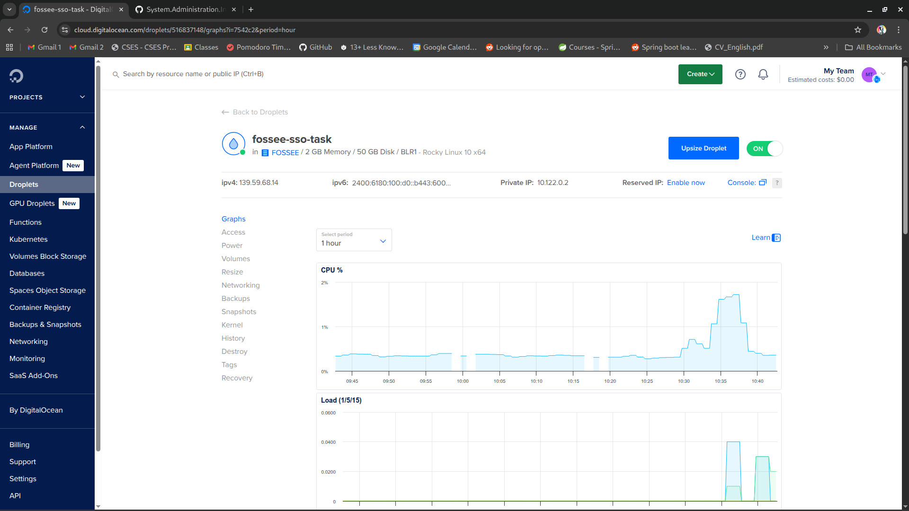
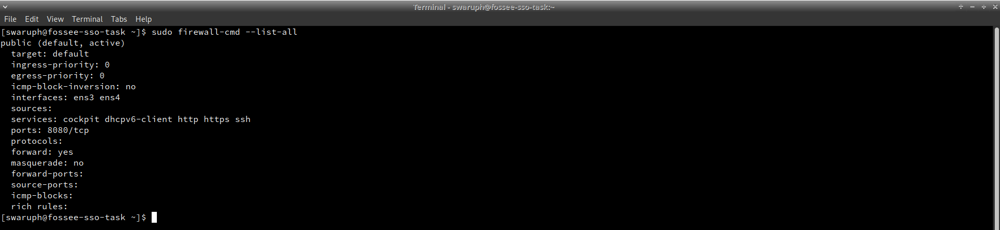
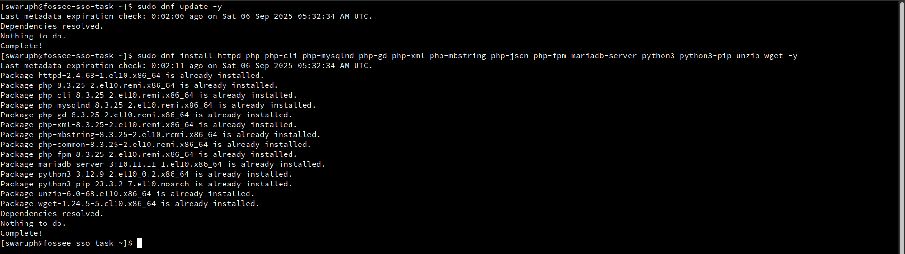
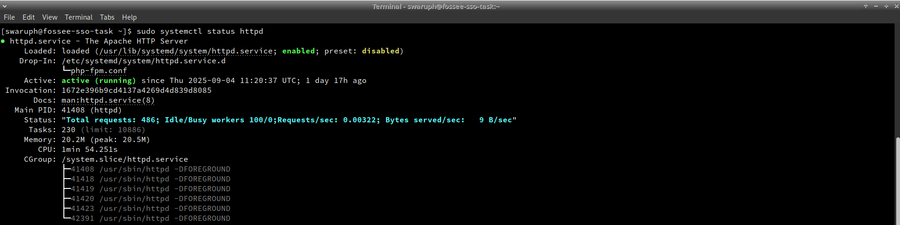
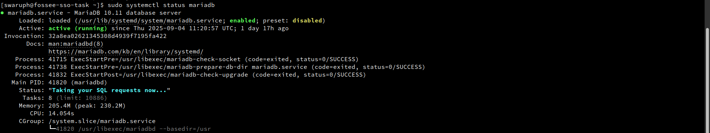
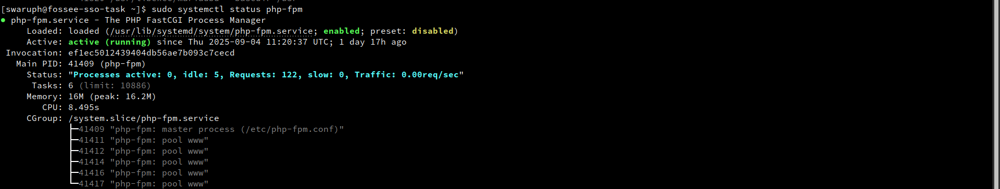

# Digital Ocean Server Implementation Documentation

## 1. Digital Ocean Droplet & Initial Setup Implementation

This section documents the actual implementation steps taken to set up the Digital Ocean droplet.

**A. Droplet Creation**

The following configuration was implemented for the droplet:

1. Login to Digital Ocean control panel
2. Navigated to Manage > Droplets > Create
3. Region: Banglore Data center:BR1
4. OS Image: Rocky Linux Version: 10x64
5. Plan: Basic Shared CPU with 2GB/1 CPU Plan
6. Authentication: Added SSH key for secure access
7. IPv6: Configured IPv6 by checking Advanced Options> Enable IPv6
8. Hostname: Set hostname as fossee-sso-task


_Digital Ocean droplet configuration and creation_

**B. Initial Server Hardening:**

Connected to the droplet as root user for initial setup:

```bash
ssh root@droplet_ip
```

Created a new administrative user with sudo privileges:

```bash
# Created the user and set a strong password
adduser swaruph
passwd swaruph

# Added the user to the 'wheel' group to grant sudo access
usermod -aG wheel swaruph
```

Copied SSH key to the new user for secure access:

```bash
# Copied SSH key for passwordless login
rsync --archive --chown=swaruph:swaruph ~/.ssh /home/swaruph
```

Enhanced security by disabling root SSH login. Modified `/etc/ssh/sshd_config` changing `PermitRootLogin yes` to `PermitRootLogin no`:

```
# Change PermitRootLogin yes to PermitRootLogin no, save and exit
sudo vi /etc/ssh/sshd_config
```

```bash
# Applied the security change
sudo systemctl restart sshd
```

Verified new user access by logging out and reconnecting: `ssh swaruph@your_droplet_ip`

**C. Firewall Configuration (Completed):**

Implemented firewall rules using firewalld:

```bash
# Installed, enabled and started the firewall service
sudo dnf install firewalld -y
sudo systemctl enable --now firewalld

# Configured permanent rules for essential services
sudo firewall-cmd --permanent --add-service=http
sudo firewall-cmd --permanent --add-service=https
sudo firewall-cmd --permanent --add-port=8080/tcp # For Keycloak access
sudo firewall-cmd --permanent --add-service=ssh

# Applied the new firewall rules
sudo firewall-cmd --reload
```


_Firewall rules configuration_

**D. System Updates & Core Component Installation:**

Performed comprehensive system setup and package installation:

```bash
# Updated all system packages to latest versions
sudo dnf update -y

# Installed EPEL and Remi repositories for current packages
sudo dnf install epel-release -y
sudo dnf install https://rpms.remirepo.net/enterprise/remi-release-10.rpm -y
sudo dnf module enable php:remi-8.3 -y

# Installed required services: Apache, PHP, MariaDB, Python, and utilities
sudo dnf install httpd php php-cli php-mysqlnd php-gd php-xml php-mbstring php-json php-fpm mariadb-server python3 python3-pip unzip wget -y

# Enabled and started all core services
sudo systemctl enable --now httpd
sudo systemctl enable --now php-fpm
sudo systemctl enable --now mariadb

# Secured the database installation
sudo mysql_secure_installation
```


_System updates and core package installation_




_Enabled and running services_

**Implementation Status:**

The Digital Ocean droplet has been successfully provisioned and configured with:

- Rocky Linux 10 operating system
- Secure user access with SSH keys
- Firewall protection with appropriate port access
- Updated system packages and core services
- Hardened database installation

**Next Steps:** Proceed with Keycloak installation and configuration as documented in [02-keycloak-setup.md](02-keycloak-setup.md).
