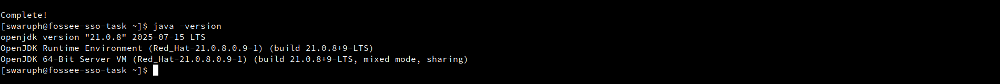
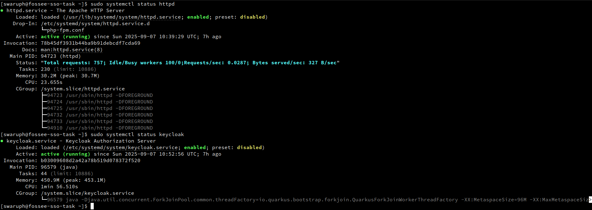
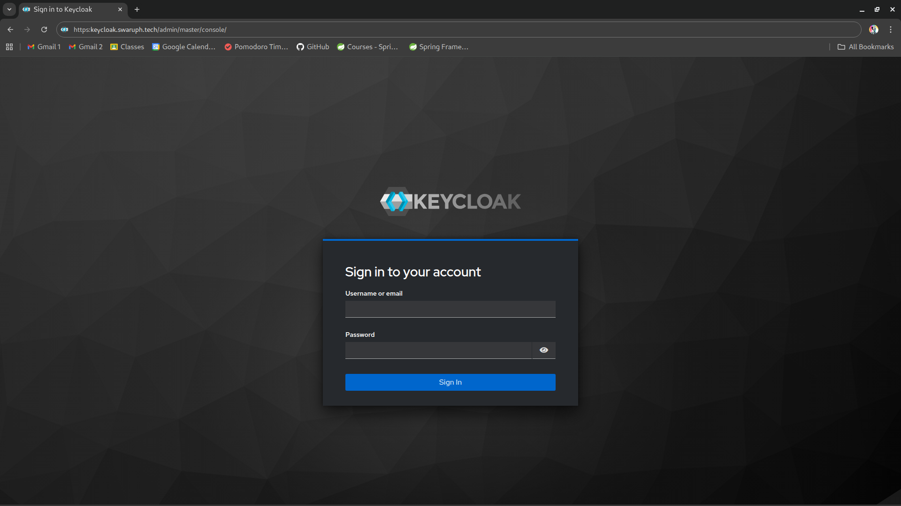
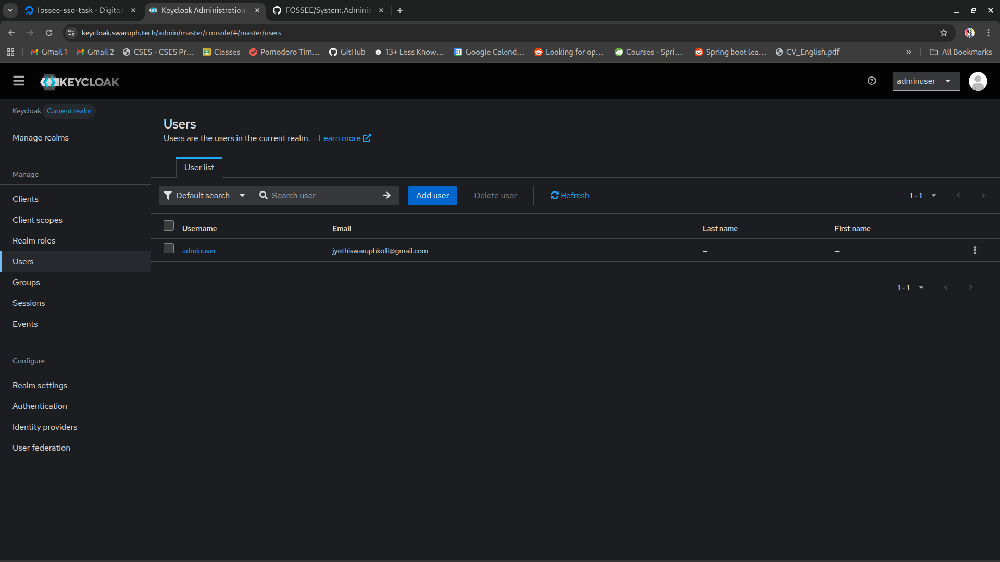

# Keycloak installation & configuration

This document covers the complete installation and configuration of Keycloak on Rocky Linux 10 and securing using **MariaDB** and **Apache with SSL**

## 1. Java installation

Keycloak requires Java. Install OpenJDK 21:

```bash
# Install Java JDK 21
sudo dnf install java-21-openjdk-devel -y

# Verify Java installation
java -version
```



## 2. Keycloak installation

### Download and install Keycloak

```bash
# Navigate to /opt for the installation
cd /opt

# Download the latest stable Keycloak (check keycloak.org/downloads for new versions)
sudo wget https://github.com/keycloak/keycloak/releases/download/26.3.3/keycloak-26.3.3.zip
sudo unzip keycloak-26.3.3.zip
sudo mv keycloak-26.3.3 keycloak

# Create a dedicated user for Keycloak
sudo groupadd keycloak
sudo useradd -r -g keycloak -d /opt/keycloak -s /sbin/nologin keycloak
sudo chown -R keycloak:keycloak /opt/keycloak

# Adjust SELinux context so that keycloak files can be executed without being blocked
sudo chcon -R -u system_u -t usr_t /opt/keycloak
```

## 3. Bootstrap Admin user

Create a temporary admin:

```bash
sudo ./bin/kc.sh build
export P=your_password
sudo --preserve-env=P ./bin/kc.sh bootstrap-admin user --username admin --password:env P
```

**Note**: This admin is temporary. After logging into the Admin Console, create a permanent admin user with the `admin` role, then remove the bootstrap user.

## 4. Configure MariaDB

Create database and user for keycloak:

```bash
# Login to MariaDB
sudo mysql -u root -p

CREATE DATABASE keycloakdb CHARACTER SET utf8mb4 COLLATE utf8mb4_unicode_ci;
CREATE USER 'keycloakuser'@'localhost' IDENTIFIED BY 'your_password';
GRANT ALL PRIVILEGES ON keycloakdb.* TO 'keycloakuser'@'localhost';
FLUSH PRIVILEGES;
EXIT;
```

Download MariaDB JDBC Driver and add it into keycloak

```bash
cd /opt/keycloak/providers
sudo wget https://repo1.maven.org/maven2/org/mariadb/jdbc/mariadb-java-client/3.5.5/mariadb-java-client-3.5.5.jar
sudo chown keycloak:keycloak mariadb-java-client-3.5.5.jar
# SELinux file context for provider JAR
sudo chcon -u system_u -t usr_t /opt/keycloak/providers/mariadb-java-client-3.5.5.jar
```

## 5. Configure keycloak

Edit `/opt/keycloak/conf/keycloak.conf`:

```bash
sudo vi /opt/keycloak/conf/keycloak.conf

# Update/add these lines

#Configure keycloak to use MariaDB instead of H2
db=mariadb
db-username=keycloakuser
db-password=your_password
db-url=jdbc:mariadb://localhost:3306/keycloakdb

# Proxy & Hostname settings
proxy=edge
proxy-headers=xforwarded

hostname=your_keycloak_domain
http-enabled=true
https-enabled=false
http-port=8080
```

Build and verify

```bash
cd /opt/keycloak
sudo -u keycloak ./bin/kc.sh build
```

## 6. Create systemd service

Create the service file `/etc/systemd/system/keycloak.service`:

```bash
[Unit]
Description=Keycloak Authorization Server
After=network.target

[Service]
Type=idle
User=keycloak
Group=keycloak
WorkingDirectory=/opt/keycloak
ExecStart=/opt/keycloak/bin/kc.sh start --optimized
LimitNOFILE=102400
LimitNPROC=102400
TimeoutStartSec=600
Restart=on-failure
RestartSec=30

# SESandbox Options
DynamicUser=no
PrivateUsers=true
ProtectSystem=strict
ProtectHome=yes
PrivateTmp=true
ProtectControlGroups=true
ProtectKernelModules=true
ProtectKernelTunables=true
ProtectClock=yes
ProtectHostname=true
ProtectProc=invisible
ReadOnlyPaths=/
ReadWritePaths=/opt/keycloak
InaccessiblePaths=/boot
CapabilityBoundingSet=
NoNewPrivileges=true
LockPersonality=true
RestrictSUIDSGID=true
RestrictRealtime=true
RestrictNamespaces=true
SystemCallFilter=@system-service
SystemCallArchitectures=native
AmbientCapabilities=
DevicePolicy=closed

[Install]
WantedBy=multi-user.target
```

Set correct owner and selinux file attributes.

```bash
sudo chcon -u system_u -t systemd_unit_file_t /etc/systemd/system/keycloak.service
sudo chown -R keycloak:keycloak /opt/keycloak
sudo chmod -R 755 /opt/keycloak

# Enable keycloak daemon service.
sudo systemctl daemon-reload
sudo systemctl enable --now keycloak
sudo systemctl status keycloak
```

## 7. Apache reverse proxy with SSL setup

Install mod_ssl and certbot for ssl/tls certificates

```bash
sudo dnf install mod_ssl certbot python3-certbot-apache -y
```

Create /etc/httpd/conf.d/keycloak.conf

```bash
<VirtualHost *:80>
    ServerName your_keycloak_domain 

    RewriteEngine On
    RewriteRule ^ https://%{HTTP_HOST}%{REQUEST_URI} [L,R=301]
</VirtualHost>
```

Obtain certificates with certbot

```bash
sudo certbot --apache -d your_keycloak_domain
```

This will generate keycloak-le-ssl.conf edit this it should look similar to this

```bash
<VirtualHost *:443>
    ServerName your_keycloak_domain #Replace with your domain name

    SSLEngine on
    SSLCertificateFile /etc/letsencrypt/live/{your_keycloak_domain}/fullchain.pem
    SSLCertificateKeyFile /etc/letsencrypt/live/{your_keycloak_domain}/privkey.pem
    Include /etc/letsencrypt/options-ssl-apache.conf

    ProxyPreserveHost On
    ProxyRequests Off
    ProxyPass        /   http://127.0.0.1:8080/
    ProxyPassReverse /   http://127.0.0.1:8080/

    RequestHeader set X-Forwarded-Proto "https"
    RequestHeader set X-Forwarded-Port "443"

    ErrorLog /var/log/httpd/keycloak_error.log
    CustomLog /var/log/httpd/keycloak_access.log combined
</VirtualHost>
```

Rebuild and verify keycloak

```bash
cd /opt/keycloak
sudo -u keycloak ./bin/kc.sh build
sudo systemctl restart keycloak
```


_Service status verification_

Now access https://your_keycloak_domain.com and login with temporary admin credentials



Create a permanent admin user inside Keycloak.

1. Go to Users > Add User
2. Enter username
3. Turn email verified on and enter Email (optional)
4. Now go to Credentials and click on set password
5. Enter your password
6. Turn off temporary
7. Now navigate to Role Mapping and click on Assign role > Realm roles and assign admin role
8. Save and relogin with new admin and delete old admin user.



## 8. Create Realm

It is better to have a realm other than master for next steps

- Go to Manage realms > Create realm
- Enter realm name: sso-apps
- Click on Create button
- Now navigate to Manage > Users > Create new user
- Email verified: on
- Username: sso-admin
- Email: your_email
- First name: your_first_name
- Last name: your_last_name
- Click on Create button
- Now open Credentials tab and click on Set password
- Enter your password and disable temporary password and Save

sso-apps realm will be used instead of master for all steps in upcoming guides

**Next Steps:** Proceed with Drupal installation and configuration as documented in [03-drupal-integration.md](03-drupal-integration.md).

