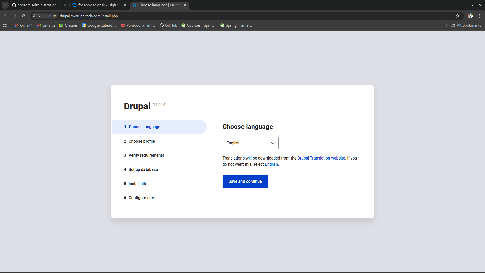
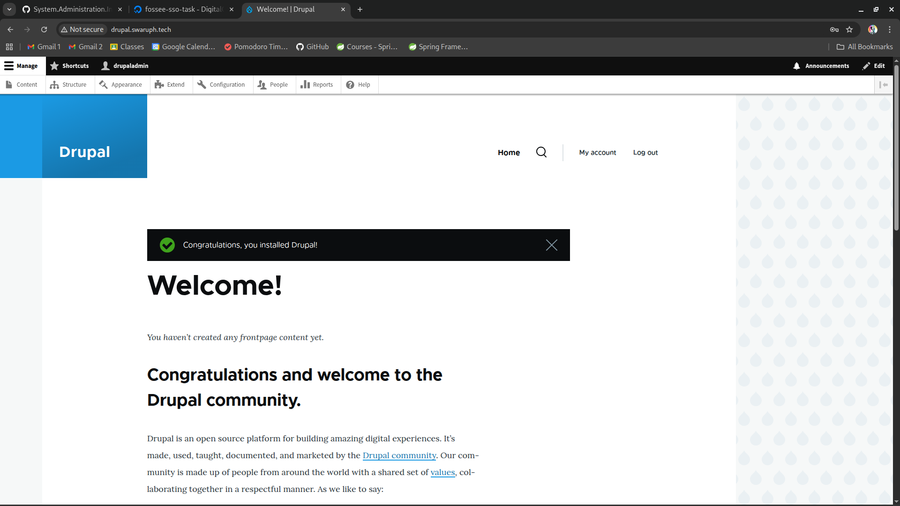
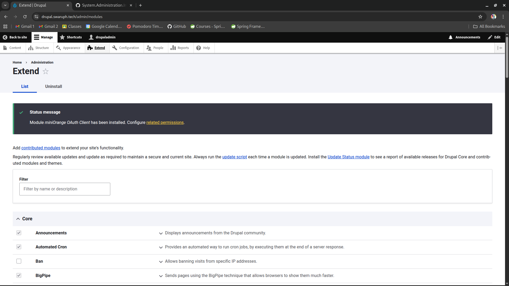
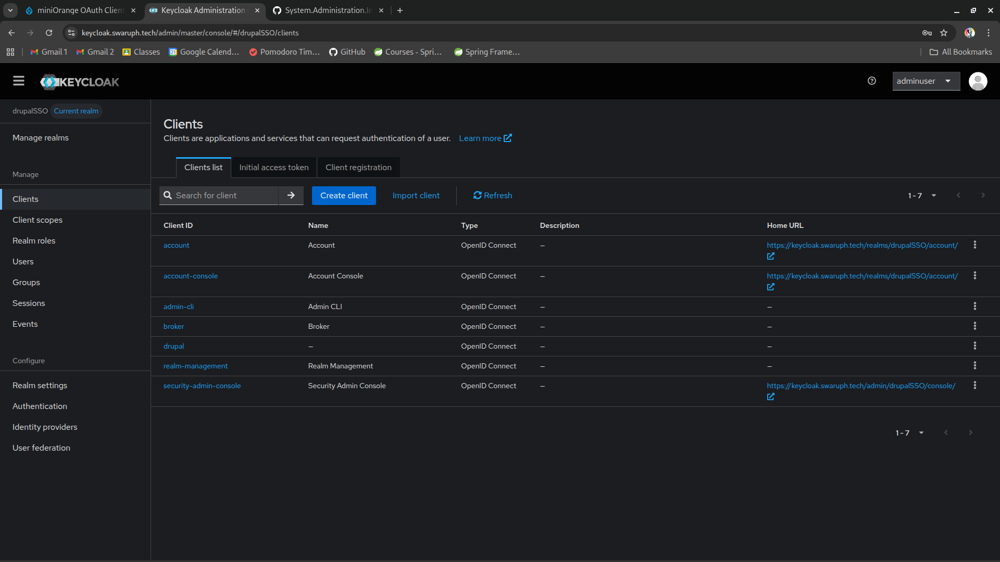
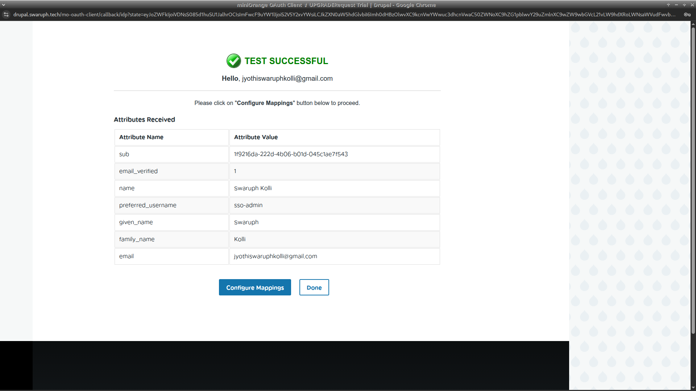
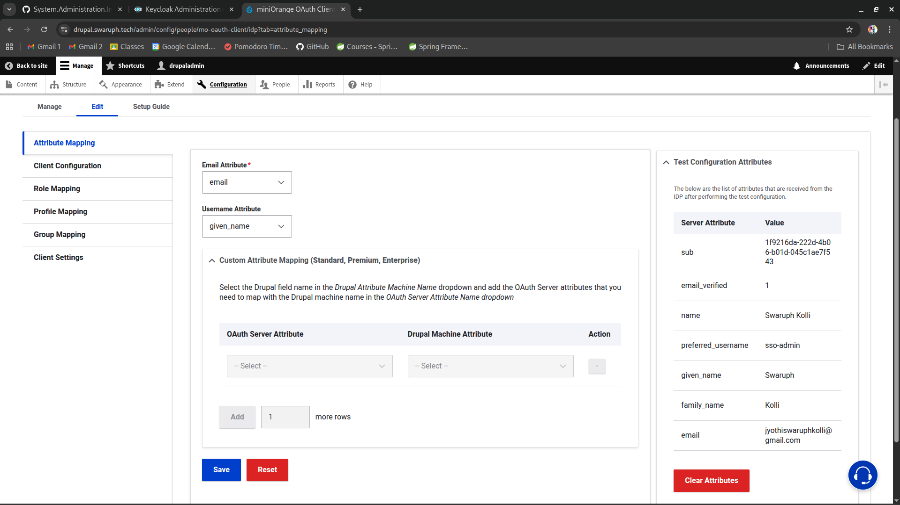
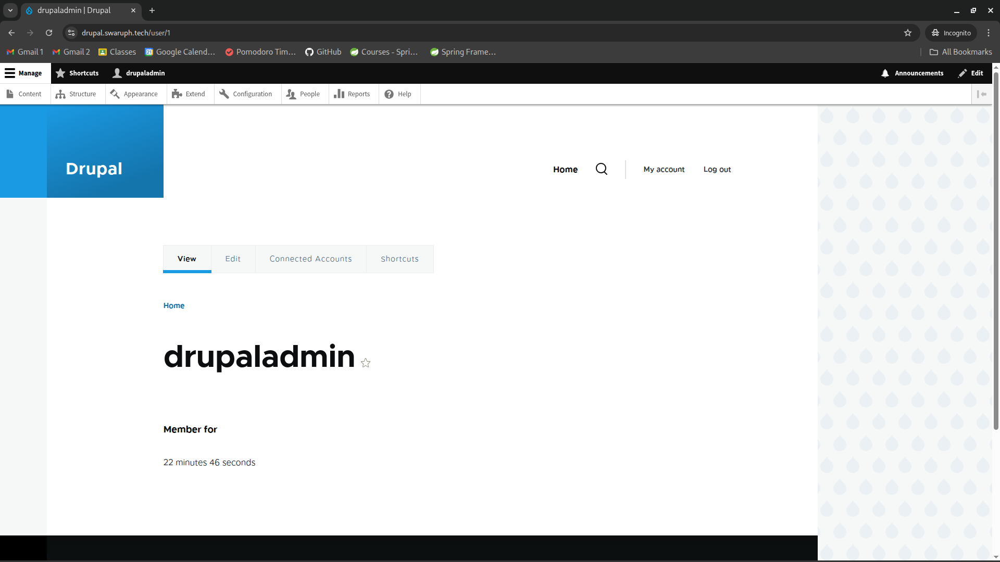

# Drupal 11 Setup & SSO

## 1. Create drupal database

```bash
sudo mysql -u root -p

CREATE DATABASE drupaldb CHARACTER SET utf8mb4 COLLATE utf8mb4_unicode_ci;
CREATE USER 'drupaluser'@'localhost' IDENTIFIED BY 'your_secure_password';
GRANT ALL PRIVILEGES ON drupaldb.* TO 'drupaluser'@'localhost';
FLUSH PRIVILEGES;
EXIT;
```

## 2. Install Drupal

```bash
cd /var/www/
sudo dnf install composer -y
sudo composer create-project drupal/recommended-project drupal
sudo chown -R apache:apache /var/www/drupal
sudo chmod -R 755 /var/www/drupal/web
```

Create dir for drupal files and rename default.settings.php to settings.php

```bash
sudo mkdir /var/www/drupal/web/sites/default/files
sudo cp /var/www/drupal/web/sites/default/default.settings.php /var/www/drupal/web/sites/default/settings.php
```

Modify this in /var/www/drupal/web/sites/default/settings.php

```php
// ...existing code...
$settings['trusted_host_patterns'] = [
  '^www\.your_drupal_domain\.com$',
];
// ...existing code...

# Example
$settings['trusted_host_patterns'] = [
  '^drupal\.swaruph\.tech$',
];
```

Change SELinux Labels

/var/www/drupal should be accessible by Apache and SELinux may block access if not configured.

```bash
sudo semanage fcontext -a -t httpd_sys_rw_content_t "/var/www/drupal(/.*)?"
sudo semanage fcontext -a -t httpd_sys_rw_content_t '/var/www/drupal/web/sites/default/settings.php'
sudo semanage fcontext -a -t httpd_sys_rw_content_t '/var/www/drupal/web/sites/default/files'

sudo restorecon -Rv /var/www/drupal/
sudo restorecon -v /var/www/drupal/web/sites/default/settings.php
sudo restorecon -Rv /var/www/drupal/web/sites/default/files

sudo chown -R apache:apache  /var/www/drupal
```

Now create Apache virtual hostfile /etc/httpd/conf.d/drupal.conf and add the following content

```conf
<VirtualHost *:80>
    ServerName your_drupal_domain
    DocumentRoot /var/www/drupal/web

    <Directory /var/www/drupal/web>
        AllowOverride All
        Require all granted
    </Directory>

    ErrorLog /var/log/httpd/drupal_error.log
    CustomLog /var/log/httpd/drupal_access.log combined
</VirtualHost>
```

Restart Apache service

```bash
sudo systemctl restart httpd
```

Now visit http://your_drupal_domain.com and complete web installation



1. Choose language
2. Choose profile > Standard
3. Verify requirements (This fails if apache is not given rw permissions , fix SELinux labels)
4. Setup Database:
   - Database type: MySQL, MariaDB,...
   - Database name: drupaldb
   - Database username: drupaluser
   - Database password: your_secure_password
   - Save and continue
5. Install site
6. Configure site

After completing these steps you will get Drupal Dashboard



Configure SSL

```bash
sudo certbot --apache -d your_drupal_domain
```

This will automatically create https virt host at /etc/httpd/conf.d/drupal-le-ssl.conf
Visit https://your_drupal_domain

## 3. Integrate SSO

### A. Install miniOrange OAuth Client module in your drupal directory (/var/www/drupal)

> The `drupal/keycloak` module is old, currently less maintained, has known bugs, and does not fully support the latest Drupal versions. The `drupal/miniorange_oauth_client` module is a well maintained and actively supported OIDC client that is fully compatible with Drupal 11 and recent versions of Keycloak. It is also widely documented and recommended in official Drupal guides.

```bash
cd /var/www/drupal
sudo composer require 'drupal/miniorange_oauth_client'
```

### B. Enable **miniOrange OAuth Client** module

1. Open Drupal admin console
2. Go to Extend and search for **miniOrange OAuth Client**
3. Enable the module by checking the checkbox and clicking the install button



### C. Configure Drupal as OAuth:

1. On your Drupal Admin console Navigate to Configuration > People > miniOrange OAuth Client Configuration and open it
2. In the **Manage** section, under the **Client Configuration** tab, click on the **+ Add New** button to configure the desired OAuth Client.
3. In Client Configuration > Add tab
   - Select Application: Keycloak
   - Custom App Name: Keycloak
   - Copy Callback/Redirect url

### D. Configure Keycloak

1. Visit keycloak admin console
2. In the Keycloak Admin Console, go to **Manage realms > sso-apps** and switch realm from master to sso-apps  .
3. Navigate to Clients > Create Client
   - **General Setting:**
     - Client Type: OpenID Connect
     - Client ID: `drupal`
     - Click on next button
   - **Capability config:** Turn Client Authentication on
   - **Login Settings:**
     - Valid redirect URIs: Paste the copied Callback/Redirect url in here
   - Save, then copy the **Client Secret** from the **Credentials** tab.



### E. Integrate Drupal with Keycloak:

1. Go to Drupal site
2. Enter the following
   - Client ID: drupal
   - Client Secret: Paste the copied Client Secret from Keycloak Drupal Client Tab here
   - Authorization Endpoint: `{your_keycloak_domain}/realms/sso-apps/protocol/openid-connect/auth`
   - Token Endpoint: `{your_keycloak_domain}/realms/sso-apps/protocol/openid-connect/token`
   - UserInfo Endpoint: `{your_keycloak_domain}/realms/sso-apps/protocol/openid-connect/userinfo`
   For the above three replace `{your_keycloak_domain}` with your Keycloak domain example https://your_keycloak_domain/ and `{your_realm_name}` with the realm name you just created in 02-keycloak-setup.
1. Now click on button Save Configuration.

### F. Test Configuration

1. In your miniOrange OAuth Client Configuration, click on Perform Test Configuration
2. You will be asked to sign in to your Keycloak administrator console, login using the username sso-admin and password which you created in sso-apps realm
3. After successfully login, you will be provided with a list of attributes that are received from Keycloak.
4. Click on Configure mapping button, you will be redirected to Attribute Mapping tab and set
   Email Attribute: Email
   Username Attribute: given_name
   Click on save button

**Note:** You should get preferred_username as drupaluser




### G. Perform SSO login

1. Open a new private tab and open Drupal login page
2. Click on Login using keycloak, you will be redirected to Keycloak admin console
3. Login with the user you created for sso
4. On successful login, you will be logged in to Drupal .


