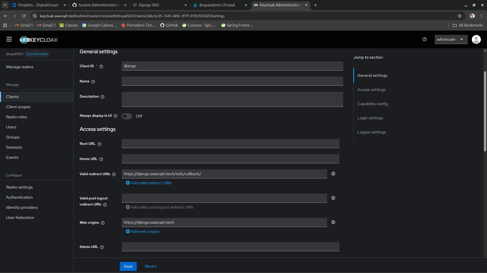
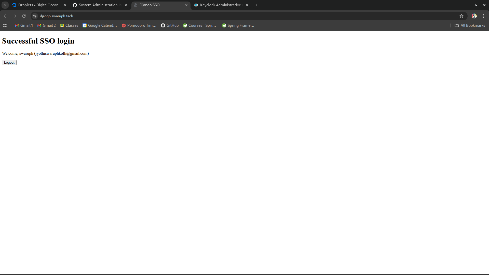

# Django Project Setup & SSO

## 1. Create Database

```bash
sudo mysql -u root -p
CREATE DATABASE djangodb;
CREATE USER 'djangouser'@'localhost' IDENTIFIED BY 'another_secure_password';
GRANT ALL PRIVILEGES ON djangodb.* TO 'djangouser'@'localhost';
FLUSH PRIVILEGES;
EXIT;
```

## 2. Set Up Django Project with Gunicorn

Install python3-devel mariadb-devel and gcc for installation of mysqlclient
```bash
# For mysqlclient 
sudo dnf install python3-devel mariadb-devel gcc -y
```

```bash
# Create project directory and virtual environment
sudo mkdir /var/www/django_project
sudo chown your_username:your_username /var/www/django_project
cd /var/www/django_project
python3 -m venv venv
source venv/bin/activate

pip install django gunicorn mozilla-django-oidc mysqlclient
```

Create project 
```bash
django-admin startproject mysite .
```

Configure network and database in settings.py

```python
ALLOWED_HOSTS = [ 'your_django_domain', 'your_droplet_ip', 'localhost']

DATABASES = {
    'default': {
        'ENGINE': 'django.db.backends.mysql',
        'NAME': 'djangodb',
        'USER': 'djangouser',
        'PASSWORD': 'your_secure_password',
        'HOST': 'localhost',
        'PORT': '3306'
    }
}

STATIC_URL = 'static/'

# Add this at the end
import os
STATIC_ROOT = os.path.join(BASE_DIR, 'static/')

```

Finish
```bash
python manage.py collectstatic
python manage.py migrate
python manage.py createsuperuser
deactivate
```

## 3. Configure Apache as a Reverse Proxy:

Create `/etc/httpd/conf.d/django.conf`:

```conf
<VirtualHost *:80>
    ServerName django.swaruph.tech
    ProxyPass / http://127.0.0.1:8000/
    ProxyPassReverse / http://127.0.0.1:8000/
</VirtualHost>
```

Configure https

```bash
sudo certbot --apache -d your_django_domain
```
Certbot will generate /etc/httpd/conf.d/django-le-ssl.conf 

Edit /etc/httpd/conf.d/django-le-ssl.conf  and this line `RequestHeader set X-Forwarded-Proto "https"`

```apache
<IfModule mod_ssl.c>
<VirtualHost *:443>
    ServerName django.swaruph.tech

    ProxyPreserveHost On
    ProxyPass / http://127.0.0.1:8000/
    ProxyPassReverse / http://127.0.0.1:8000/
    
	RequestHeader set X-Forwarded-Proto "https"

    ErrorLog /var/log/httpd/django_error.log
    CustomLog /var/log/httpd/django_access.log combined

    SSLCertificateFile /etc/letsencrypt/live/django.swaruph.tech/fullchain.pem
    SSLCertificateKeyFile /etc/letsencrypt/live/django.swaruph.tech/privkey.pem
    Include /etc/letsencrypt/options-ssl-apache.conf
</VirtualHost>
</IfModule>
```

Update /var/www/django_project/mysite/settings.py
```python
# Enfore HTTPS
SECURE_SSL_REDIRECT = True
CSRF_COOKIE_SECURE = True
SESSION_COOKIE_SECURE = True
SECURE_PROXY_SSL_HEADER = ('HTTP_X_FORWARDED_PROTO', 'https')
```
## 4. Create Gunicorn service

```conf
[Unit]
Description=Gunicorn for Django mysite
After=network.target

[Service]
User=swaruph
Group=apache
WorkingDirectory=/var/www/django_project
Environment="PATH=/var/www/django_project/venv/bin"
ExecStart=python3 /var/www/django_project/venv/bin/gunicorn --workers 3 --bind 127.0.0.1:8000 mysite.wsgi:application
Restart=always

[Install]
WantedBy=multi-user.target
```

Reload and start the gunicorn service

```bash
sudo systemctl daemon-reload
sudo systemctl enable --now gunicorn
sudo systemctl status gunicorn
sudo systemctl restart httpd
```


## 5. Integrate Keycloak SSO

A. Create django client
- Open keycloak admin console and Navigate to the realm we created for drupal 
- Manage > Clients > Create client
- Client ID: django
- Client Authentication: on
- Valid redirect URIs: https://your_django_domain/oidc/callback/
- Save and copy the Client Secret from the credentials tab



B. Update mysite/settings.py

```python
INSTALLED_APPS += ['mozilla_django_oidc']

AUTHENTICATION_BACKENDS = [
    'mozilla_django_oidc.auth.OIDCAuthenticationBackend',
    'django.contrib.auth.backends.ModelBackend',
]

OIDC_RP_CLIENT_ID = "django"
OIDC_RP_CLIENT_SECRET = "your_client_secret"

OIDC_OP_AUTHORIZATION_ENDPOINT = "https://{your_keycloak_domain}/realms/drupalSSO/protocol/openid-connect/auth"
OIDC_OP_TOKEN_ENDPOINT = "https://{your_keycloak_domain}/realms/drupalSSO/protocol/openid-connect/token"
OIDC_OP_USER_ENDPOINT = "https://{your_keycloak_domain}/realms/drupalSSO/protocol/openid-connect/userinfo"
OIDC_RP_SIGN_ALGO = "RS256"
OIDC_OP_JWKS_ENDPOINT = "https://{your_keycloak_domain}/realms/drupalSSO/protocol/openid-connect/certs"


LOGIN_URL = 'oidc_authentication_init'
LOGIN_REDIRECT_URL = '/'
LOGOUT_REDIRECT_URL = '/'

```

## 6. Create Django app for homepage

```bash
cd /var/www/django_project
source venv/bin/activate
python manage.py startapp home
```
A new dir home will be created in django_project dir

Open mysite/settings.py and add home app in INSTALLED_APPS
```python
INSTALLED_APPS = [
    # ...
    'home',
]
```

Add view home/views.py
```python
from django.shortcuts import render
from django.contrib.auth.decorators import login_required

# Create your views here.

@login_required
def home(request):
    return render(request, 'home/index.html')
```

Create index.html in home/templates/home/

```bash
mkdir home/templates/home/
```

Now create a html file home/templates/home/index.html

```html
<!DOCTYPE html>
<html lang="en">
<head>
    <meta charset="UTF-8">
    <title>Django SSO</title>
</head>
<body>
    
        <h1>Successful SSO login</h1>
        <p>Welcome, {{ user.get_username }} ({{ user.email }})</p>
        <form action="" method="post">
            
            <button type="submit">Logout</button>
        </form>
    
        <a href="">Login with SSO</a>
    
</body>
</html>
```

Add home/urls.py 

```python
from django.urls import path
from .views import home

urlpatterns = [
    path('', home, name='home'),
]
```

Add home/urls.py in mysite/urls.py

```python
"""
URL configuration for mysite project.

The `urlpatterns` list routes URLs to views. For more information please see:
    https://docs.djangoproject.com/en/5.2/topics/http/urls/
Examples:
Function views
    1. Add an import:  from my_app import views
    2. Add a URL to urlpatterns:  path('', views.home, name='home')
Class-based views
    3. Add an import:  from other_app.views import Home
    4. Add a URL to urlpatterns:  path('', Home.as_view(), name='home')
Including another URLconf
    5. Import the include() function: from django.urls import include, path
    6. Add a URL to urlpatterns:  path('blog/', include('blog.urls'))
"""
from django.contrib import admin
from django.urls import path, include

urlpatterns = [
    path('admin/', admin.site.urls),
    path('oidc/', include('mozilla_django_oidc.urls')),
    path('', include('home.urls')),
]

```

## 7. Perform SSO login

Now visiting `https://your_django_domain` will redirect to **Keycloak login** (login with the user you created in new realm) and return to Django with the authenticated user session.

