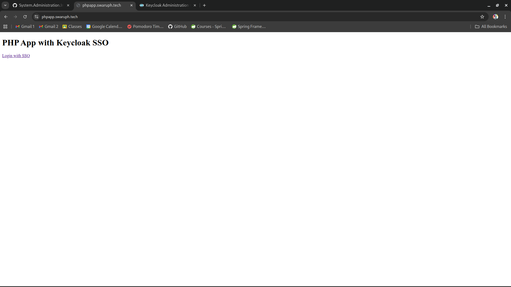
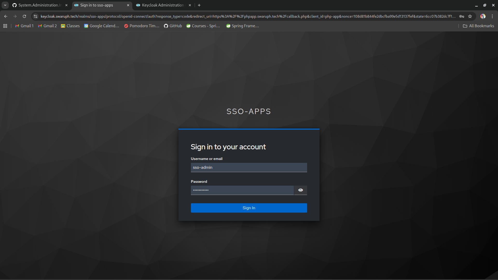
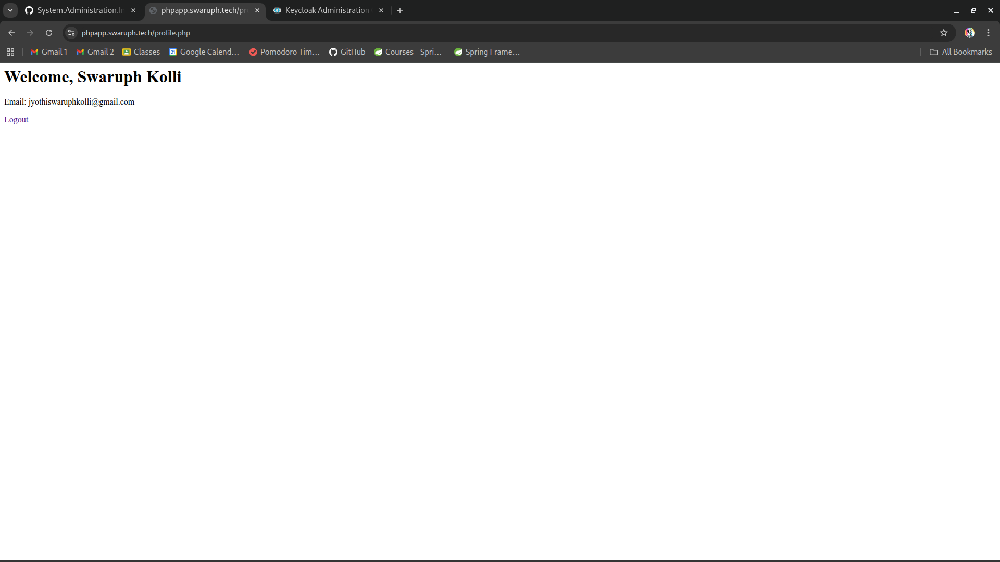
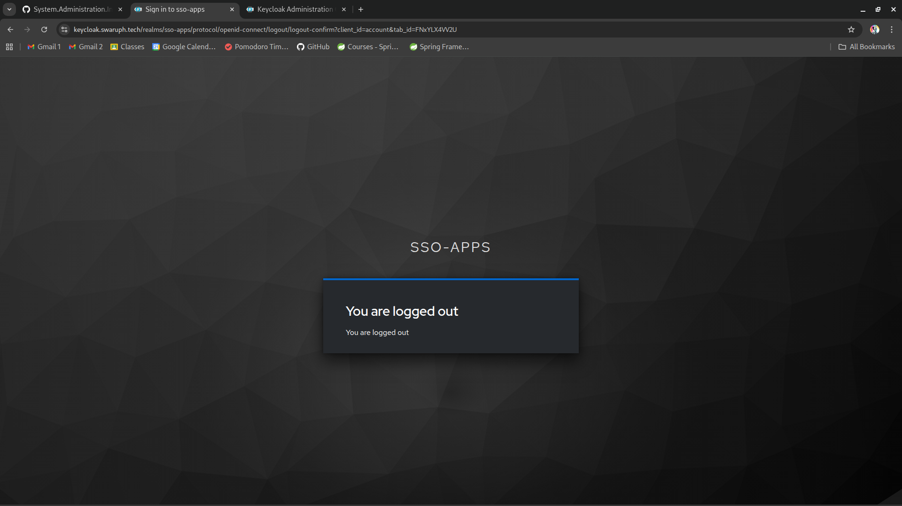

# PHP Application Setup & SSO

## 1. Setup PHP directory

```bash
sudo mkdir /var/www/php_app
sudo chown -R apache:apache /var/www/php_app
sudo chmod -R 755 /var/www/php_app
```

## 2. Create vhost for PHP app

Create /etc/httpd/conf.d/php_app.conf

```conf
<VirtualHost *:80>
    ServerName your_php_app_domain
    DocumentRoot /var/www/php_app

    <Directory /var/www/php_app>
        AllowOverride All
        Require all granted
    </Directory>
</VirtualHost>
```

Enable SSL

```bash
sudo certbot --apache -d your_php_app_domain
```

This will generate /etc/httpd/conf.d/php_app-le-ssl.conf, it should look similar to this

```conf
<IfModule mod_ssl.c>
<VirtualHost *:443>
    ServerName your_php_app_domain
    DocumentRoot /var/www/php_app

    <Directory /var/www/php_app>
        AllowOverride All
        Require all granted
    </Directory>

    SSLCertificateFile /etc/letsencrypt/live/your_php_app_domain/fullchain.pem
    SSLCertificateKeyFile /etc/letsencrypt/live/your_php_app_domain/privkey.pem
    Include /etc/letsencrypt/options-ssl-apache.conf
</VirtualHost>
</IfModule>
```

Restart Apache:

```bash
sudo systemctl restart httpd
sudo systemctl status httpd
```

## 3. Keycloak SSO integration

Install php oidc library

```bash
cd /var/www/php_app
sudo composer require jumbojett/openid-connect-php
```

Configure Keycloak client

- Open Keycloak Admin console
- Switch to sso-apps realm
- Navigate to Manage > Clients > Create client
- Set client name: php-app
- Turn Client Authentication: on
- Valid redirect urls: https://your_php_app_domain/callback.php
- Save and copy Client Secret from Credentials tab

## 4. PHP Application files

Add these files in /var/www/php_app

index.php

```php
<?php
session_start();
?>
<!DOCTYPE html>
<html>
  <body>
    <h1>PHP App with Keycloak SSO</h1>
    <?php if (!empty($_SESSION['user_info'])): ?>
      <p>Welcome, <?php echo htmlspecialchars($_SESSION['user_info']->name); ?>!</p>
      <a href="profile.php">Go to Profile</a> | <a href="logout.php">Logout</a>
    <?php else: ?>
      <a href="login.php">Login with SSO</a>
    <?php endif; ?>
  </body>
</html>
```

login.php

```php
<?php
require 'vendor/autoload.php';
use Jumbojett\OpenIDConnectClient;

session_start();

$oidc = new OpenIDConnectClient(
    'https://{your_keycloak_domain}/realms/sso-apps', // Keycloak provider URL
    'php-app',                                  // Client ID
    'your_client_secret'          // Client Secret
);

$oidc->setRedirectURL('https://{your_php_app_domain}/callback.php');
$oidc->addScope(['openid', 'email', 'profile']);

// This triggers the authentication flow
$oidc->authenticate();
```

callback.php

```php
<?php
require 'vendor/autoload.php';
use Jumbojett\OpenIDConnectClient;

session_start();

$oidc = new OpenIDConnectClient(
    'https://{your_keycloak_domain}/realms/sso-apps',
    'php-app',
    'your_client_secret'
);

$oidc->setRedirectURL('https://{your_php_app_domain}/callback.php');
$oidc->addScope(['openid', 'email', 'profile']);
$oidc->authenticate();

$_SESSION['user_info'] = $oidc->requestUserInfo();

header("Location: /profile.php");
exit();
```

profile.php

```php
<?php
session_start();
if (empty($_SESSION['user_info'])) {
    header("Location: /login.php");
    exit();
}

$userInfo = $_SESSION['user_info'];
echo "<h1>Welcome, " . htmlspecialchars($userInfo->preferred_username) . "</h1>";
echo "<p>Email: " . htmlspecialchars($userInfo->email) . "</p>";
echo '<a href="/logout.php">Logout</a>';
```

logout.php

```php
<?php
session_start();
session_destroy();

$keycloak_logout = "https://{your_keycloak_domain}/realms/sso-apps/protocol/openid-connect/logout?redirect_uri=https://{your_php_app_domain}";

header("Location: " . $keycloak_logout);
exit();
```

## 6. Perform SSO Login

- Open https://your_php_app_domain and click on Login with keycloak



- You will be redirected to keycloak
  
- Enter your keycloak credentials
- You will be redirected to profile.php




